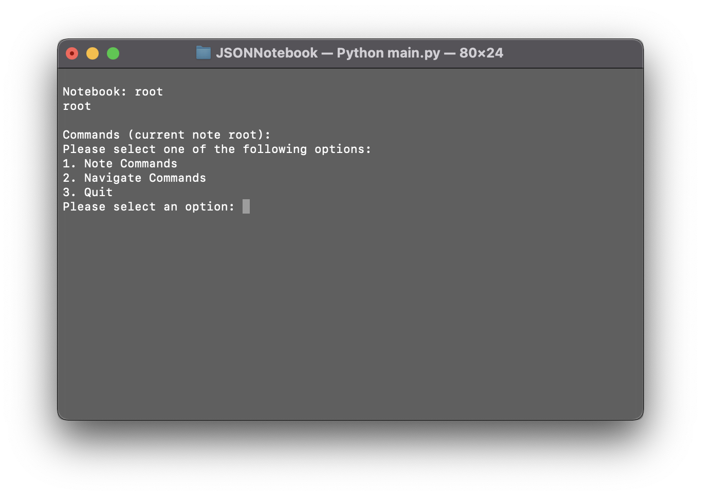
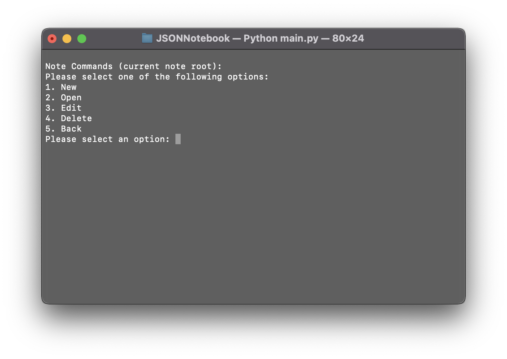
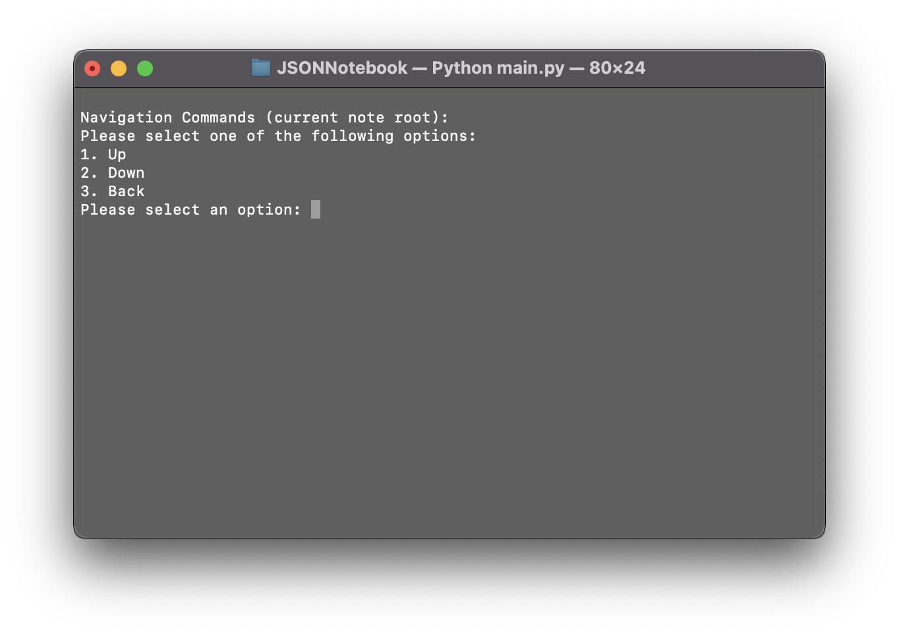

# JSONNotebook
## Introduction
A fun project I thought I'd try my hand at to implement OOP paradigms in a tree datastructure.
Feel free to post an issue if you spot a bug or fork if you want to use some of the code yourself.

## Installation
No installation required, simply run main.py from the terminal.

## Instructions
### Main Commands
After launching the program, you will be greeted by the main Commands screen and prompted to choose a command to execute.

### Note Commands
The Note Commands screen allows you to create, open, edit, and delete notes.

### Navigation Commands
The Navigation Commands screen allows you to navigate through the tree structure of the JSONNotebook. You can travel Up (to the parent note) or Down (to a selected child note). Once a note is selected, following commands issued will be executed on that note.
